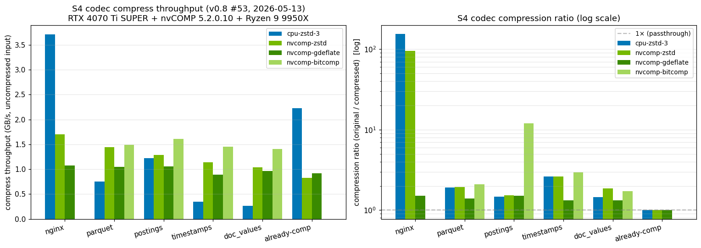

# S4 — Squished S3

[](https://github.com/abyo-software/s4/actions/workflows/ci.yml)
[](https://github.com/abyo-software/s4/actions/workflows/fuzz-nightly.yml)
[](https://github.com/abyo-software/s4/actions/workflows/aws-e2e.yml)
[](LICENSE)
[](https://www.rust-lang.org)

> **Drop-in S3-compatible storage gateway with GPU-accelerated transparent compression.**
> Reduces S3 **storage bytes** 50–80% for compressible payloads (logs, JSON,
> Parquet/ORC) without changing application code. Total bill impact depends on
> workload mix — request cost / egress / GPU compute are unchanged.

[日本語版 README → `README.ja.md`](README.ja.md)

**Headline numbers** (RTX 4070 Ti SUPER + Ryzen 9 9950X, single-pass roundtrip
through `s4-codec`, last benchmarked 2026-05-13 on nvCOMP 5.2.0.10 / CUDA
13.2 driver 595.58.03; full table + reproduction recipe below):

| Workload | Best ratio | Best compress throughput | Codec verdict |
|---|---:|---:|---|
| nginx access log (256 MiB)   | **155×** (cpu-zstd-3) | 3.7 GB/s (cpu-zstd-3) | CPU wins — text deduplicates well at low CPU cost |
| Parquet-like mixed (256 MiB) | **2.09×** (nvcomp-bitcomp) | 1.5 GB/s (nvcomp-bitcomp) | GPU wins on Bitcomp for integer/columnar layouts |
| Postings (u32, 64 MiB)       | **11.9×** (nvcomp-bitcomp) | 1.6 GB/s (nvcomp-bitcomp) | GPU wins decisively on monotonic integer columns |
| Already-compressed (64 MiB)  | 1.00× (passthrough)  | 2.2 GB/s (passthrough)| Dispatcher detects + skips — no codec cost |

**Codec selection is not always GPU** (#96 #97). The dispatcher samples
entropy + magic bytes and routes per object:

- text / log → `cpu-zstd-3` (often beats GPU codecs both on ratio AND
  throughput at the input size where everything fits in L3)
- columnar integers (Parquet / postings / time-series) →
  `nvcomp-bitcomp` (GPU's strength on integer/columnar layouts).
  Two modes:
  - explicit: `--codec nvcomp-bitcomp` always picks Bitcomp regardless
    of sample content
  - automatic: `--prefer-columnar-gpu` (opt-in) lets the sampling
    dispatcher detect a u32 / u64 LE integer column via per-stride
    byte-position entropy and route to Bitcomp once the body is
    `>= --gpu-min-bytes`. Default is off so v0.8.11-or-earlier
    deployments are bit-for-bit unchanged
- already-compressed (mp4 / jpeg / parquet-with-zstd-block-codec / `.gz`
  detected by magic byte) → `passthrough` (no harm done)
- non-GPU build OR no GPU at runtime → CPU codecs end-to-end

Observe which codec was chosen via the `s4_codec_chosen_total{codec="..."}`
Prometheus counter, or per-PUT in the structured JSON access log
(`{"codec_chosen":"..."}`). GPU is a multiplier on the *integer/columnar*
side of mixed workloads, not a blanket "compress with GPU" claim.

Translated to AWS S3 Standard at $0.023/GB/month: **1 TiB of nginx log
data → ~6.6 GiB stored → $0.15/month vs $23.55/month uncompressed (99%
storage savings, single-pass)**. Mixed-content Parquet workloads see ~50%
storage savings.

**What this number does and doesn't cover** (#95): storage-bytes only.
PUT/GET request cost is unchanged (1 PUT in = 1 PUT out, plus a small
`.s4index` sidecar PUT for indexed range-read). Egress is unchanged
(GET serves the decompressed payload). GPU compute is a separate cost
(c. EC2 g4dn / g5 hourly) — pays for itself on TB-scale, not GB-scale,
ingest. See [Cost savings — does S4 make sense for your bill?](#cost-savings-does-s4-make-sense-for-your-bill) below for the
break-even maths.

---

## What is S4?

S4 (**Squished S3**) is an S3-compatible storage gateway written in Rust that
sits between your applications (boto3 / aws-sdk / aws-cli / Spark / Trino /
DuckDB / anything S3) and your real S3 bucket — and **transparently compresses
each object** with a codec the dispatcher picks per-payload: GPU
(NVIDIA nvCOMP zstd / Bitcomp / GDeflate) for integer/columnar data, CPU
zstd / gzip for text/log, passthrough (no codec cost) for already-compressed
inputs. See [the codec verdict table](#headline-numbers) above for the routing rules.

```
                        endpoint: s4.example.com
   your application ──────────────────────────▶  S4 (this project)
   (boto3, Spark,                                       │
    Trino, ...)                                         ▼
                                            (compress with GPU)
                                                        │
                                                        ▼
                                                 AWS S3 (real bucket)
```

- **No app changes**: same S3 wire protocol, same SigV4 auth, same SDK calls
- **Transparent**: PUT compresses, GET decompresses; clients see the original bytes
- **Open format, no lock-in**: stop the gateway and the **compressed
  objects + S4IX sidecars remain S3-native** — readable by stock `aws-cli`
  / boto3 / any S3 client. The **original payload** then requires
  `s4-codec` (CLI tool), `s4-codec-py` (pip), or `s4-codec-wasm` (browser)
  to decompress — all Apache-2.0, ~1k LOC of pure decode, no gateway runtime
  needed. The wire format (S4F2 frame + S4IX sidecar) is documented in
  the source: [`crates/s4-codec/src/multipart.rs`](crates/s4-codec/src/multipart.rs) (frame layout) and
  [`crates/s4-codec/src/index.rs`](crates/s4-codec/src/index.rs) (sidecar layout)

## Why S4?

| Problem | Solution |
|---|---|
| Your S3 bill grows linearly with data, but most data is ≥3× compressible | S4 compresses on the way in, charging you only for the squished bytes |
| Your apps don't compress data themselves (and you don't want to change them) | S4 is a wire-compatible drop-in — just change `--endpoint-url` |
| Existing object-storage compressors (MinIO S2, Garage zstd) are CPU-only | S4 supports nvCOMP **GPU** codecs — Bitcomp gives 3.6–7.5× on integer columns |
| Analytics workloads need byte-range reads | S4 supports `Range` GET via sidecar frame index (parquet/ORC reader compatible) |

## Quick Start

### Install via cargo (Rust devs)

```bash
cargo install s4-server                                  # CPU build
s4 --endpoint-url https://s3.us-east-1.amazonaws.com     # binary is `s4`, not `s4-server`
```

**Caveats** (v0.8.8, #98):
- Requires Rust 1.92+ (`rustup update stable` first).
- The default `cargo install` builds **CPU codecs only**. GPU codecs
  (`nvcomp-zstd` / `Bitcomp` / `GDeflate`) require `cargo install s4-server
  --features nvcomp-gpu`, which needs the CUDA toolchain and `NVCOMP_HOME`
  pointing at an extracted nvCOMP SDK at build time. Without these the build
  fails at link time with an `nvcomp` lib not found error.
- The installed binary is `s4` (not `s4-server`); check with `which s4`.

### 60-second local trial (Docker, CPU-only)

```bash
git clone https://github.com/abyo-software/s4 && cd s4
docker compose up -d                    # MinIO + S4 server on localhost:8014

# Generate a sample object so the cp lines have something to upload.
head -c 100M /dev/urandom | base64 > big.log    # ~135 MiB of text, compresses well

# Use any S3 client. Below uses aws-cli; replace endpoint with anything.
aws --endpoint-url http://localhost:8014 s3 mb s3://demo
aws --endpoint-url http://localhost:8014 s3 cp big.log s3://demo/big.log
aws --endpoint-url http://localhost:8014 s3 cp s3://demo/big.log ./big.log.roundtrip

# Inspect the compressed object directly on MinIO (different endpoint, bypasses S4).
aws --endpoint-url http://localhost:9000 s3 cp s3://demo/big.log ./big.log.compressed
ls -la big.log big.log.compressed big.log.roundtrip
# Expected: big.log == big.log.roundtrip (lossless), big.log.compressed is much smaller.
```

### Try with GPU compression (NVIDIA nvCOMP)

```bash
# Requires NVIDIA Container Toolkit + a CUDA-capable GPU
docker compose -f docker-compose.gpu.yml up -d
aws --endpoint-url http://localhost:8014 s3 cp parquet-file.parq s3://demo/
```

See [docker-compose.gpu.yml](docker-compose.gpu.yml) for details.

### Kubernetes (Helm)

⚠️ **Build the image yourself first** (#108) — no `abyosoftware/s4` image is
published to Docker Hub or ghcr.io yet (roadmap; expected after the first
public production user is onboarded so we have something concrete to tag).
For now, the chart expects you to build + push to your own registry:

```bash
# 1. Build and push to your registry (substitute MY_REGISTRY)
docker build -t MY_REGISTRY/s4:0.8.9 .
docker push MY_REGISTRY/s4:0.8.9

# 2. Install pointing at your image
helm install s4 ./charts/s4 \
  --set image.repository=MY_REGISTRY/s4 \
  --set image.tag=0.8.9 \
  --set backend.endpointUrl=https://s3.us-east-1.amazonaws.com \
  --set backend.region=us-east-1
kubectl port-forward svc/s4 8014:8014
```

The chart in [`charts/s4/`](charts/s4/) ships a stateless Deployment + Service
(ClusterIP, port 8014), optional GPU node selector (`gpu.enabled=true` for
nvCOMP), inline or cert-manager TLS, and bucket-policy ConfigMap. See
[charts/s4/README.md](charts/s4/README.md) for the full values table.

### Python (pip)

For ML / ETL pipelines that just want the codec without the gateway:

```python
from s4_codec import CpuZstd, CpuGzip, gpu_available
codec = CpuZstd(level=3)
compressed, original_size, crc = codec.compress(data_bytes)
roundtrip = codec.decompress(compressed, original_size, crc)
```

PyO3 bindings live in [`crates/s4-codec-py/`](crates/s4-codec-py/) — build
with `maturin build --release` (and `--features nvcomp-gpu` for GPU).

### Browser (WASM)

For frontend apps that read S4-compressed objects directly from S3 over a
presigned URL, no S4 server in the read path:

```bash
rustup target add wasm32-unknown-unknown
wasm-pack build --release --target web crates/s4-codec-wasm  # → pkg/
```

The bundle exports `decompressFramed` / `decompressSingle` for the CPU
codec subset (`passthrough`, `cpu-zstd`, `cpu-gzip`). See
[`crates/s4-codec-wasm/README.md`](crates/s4-codec-wasm/README.md) for
the API and a 10-line example.

### Build from source

```bash
cargo build --release --workspace                       # CPU-only
NVCOMP_HOME=/path/to/nvcomp cargo build --release --workspace --features s4-server/nvcomp-gpu

target/release/s4 --endpoint-url https://s3.us-east-1.amazonaws.com \
    --host 0.0.0.0 --port 8014 --codec cpu-zstd --log-format json
```

## How it Compares

| Feature | S4 | [MinIO](https://github.com/minio/minio) | [Garage](https://git.deuxfleurs.fr/Deuxfleurs/garage) | Wasabi / B2 | AWS S3 |
|---|---|---|---|---|---|
| Stance | Transparent-compression proxy in front of an existing S3 backend | Standalone S3-compatible storage system | Standalone S3-compatible storage system | Hosted S3-compatible storage | The reference |
| S3 API compatibility | See [matrix below](#s3-api-compatibility-matrix) | Comprehensive | Subset | Comprehensive | Native |
| **GPU compression** | ✅ nvCOMP zstd / Bitcomp / GDeflate | ❌ | ❌ | ❌ | ❌ |
| **CPU compression** | ✅ zstd 1–22 / gzip | ⚠️ S2 only (legacy) | ✅ zstd 1–22 | ❌ | ❌ |
| **Auto codec selection** | ✅ entropy + magic-byte sampling | ❌ | ❌ | — | — |
| **Range GET on compressed** | ✅ via S4IX sidecar (see [matrix](#s3-api-compatibility-matrix) for the range modes supported) | n/a | n/a | ✅ | ✅ |
| **Streaming I/O** | ✅ chunked PUT / GET; GPU per-chunk pipelined ([conditions](#streaming-io)) | ✅ | ✅ | ✅ | ✅ |
| **Native HTTPS / TLS** | ✅ rustls + ring, ALPN h2 | ⚠️ via reverse proxy | ⚠️ via reverse proxy | ✅ | ✅ |
| **Bucket-policy enforcement at gateway** | ✅ AWS-style JSON, Allow / Deny | n/a | n/a | ✅ | ✅ |
| **Acts as gateway to existing S3** | ✅ (the whole point) | ❌ (gateway mode removed upstream) | ❌ | ❌ | n/a |
| **License** | Apache-2.0 | upstream LICENSE: AGPLv3 (+ commercial) | upstream LICENSE: AGPLv3 | proprietary | proprietary |

*(MinIO / Garage license cells link to upstream LICENSE files; project licenses
 can change between releases. Do not treat as legal advice. See #103.)*

### S3 API compatibility matrix

S4 implements the parts of the S3 API needed to act as a transparent
compression proxy in front of an existing bucket. **It is not a complete
S3 implementation** — operations marked "—" return `NotImplemented` and
should not be called against an S4 endpoint. PRs welcome on the matrix
rows you need.

| Surface | Status | Notes |
|---|---|---|
| PUT / GET object | ✅ Full | single-PUT + range-GET (see below) |
| Multipart upload (create / part / complete / abort) | ✅ Full | with per-part framing + final-part padding trim |
| HEAD object | ✅ Full | returns post-compression `Content-Length` (matches what S3 returns; original size in `x-amz-meta-s4-original-size`) |
| Range GET | ✅ S3 spec | `bytes=N-M`, `bytes=-N` (suffix), `bytes=N-` (open-ended); range maps through S4IX sidecar to compressed byte offsets |
| Conditional GET / PUT (`If-Match` / `If-None-Match` / `If-Modified-Since`) | ✅ Full | |
| PutObjectAcl / GetObjectAcl | ✅ canned ACLs only | `private` / `public-read` / `public-read-write` / `authenticated-read` / `aws-exec-read` / `bucket-owner-read` / `bucket-owner-full-control` |
| Bucket versioning | ✅ Full | per-version UUIDv4 ID, delete-marker semantics |
| Object lock (Governance / Compliance) | ✅ Full | per-object retention + legal-hold |
| Bucket lifecycle (`LifecycleConfiguration`) | ✅ Full | Expiration / NoncurrentVersionExpiration / AbortIncompleteMultipartUpload |
| Bucket notifications (Webhook / SQS / SNS) | ✅ Full | SQS/SNS gated behind `aws-events` feature |
| Bucket replication | ✅ Full | rule-based, per-PUT dispatcher |
| Bucket policy | ✅ AWS-style JSON | Allow / Deny, IAM Conditions subset (see #100) |
| Tagging (object / bucket) | ✅ Full | |
| CORS configuration | ✅ Full | |
| Inventory | ✅ Full | CSV / Parquet output |
| MFA Delete | ✅ Full | RFC 6238 TOTP |
| SSE-S3 (server-side, S4-managed keys) | ✅ Full | AES-256-GCM (S4E1/S4E2 wire) |
| SSE-KMS (envelope encryption) | ✅ Full | LocalKms (file-backed KEKs) default; AWS KMS gated behind `aws-kms` feature |
| SSE-C (customer-provided key) | ✅ Full | (S4E3 wire) |
| S3 Select | ✅ subset | CSV input, single-column equality / inequality / GT / LT / LIKE-prefix; falls back to CPU eval where unsupported |
| Presigned URLs | ✅ Full | both PUT and GET |
| SigV4 / SigV4a auth | ✅ Full | SigV4a requires `--sigv4a-credentials <DIR>` |
| Storage class transitions (Standard ↔ IA ↔ Glacier) | ✅ tagging-driven | see [docs/storage-class-transitions.md](docs/storage-class-transitions.md) |
| Cross-region replication via S4 chain | — | use AWS S3 native CRR on the backend |
| RequestPayment / Accelerate / Logging configuration | — | not implemented; report a 501 |

**Range GET caveat** (#99): the S4IX sidecar gives a per-frame index, so
range maps to a contiguous read of the covering frames and a decode that's
sliced at the boundaries the caller asked for. Parquet/ORC readers
(arrow-rs, datafusion, duckdb's parquet reader) that issue suffix-range
GET against the footer work out of the box. Parallel range reads against
overlapping frame extents do extra decode work and are not yet optimized;
see #99 for the parquet/ORC reader cross-validation harness on the
roadmap.

### SDK compatibility matrix

Test status per major S3 client. "Tested" means a green E2E run in CI or
documented manual verification; "Should work" means the wire shape is
satisfied but no explicit test covers it yet; "Known issue" links to the
relevant issue.

| Client | Status | Notes |
|---|---|---|
| `aws-cli` (v2.x) | ✅ Tested | path-style + virtual-hosted URLs, presigned URLs, multipart, range GET |
| `boto3` (Python) | ✅ Tested | via `s4-codec-py` integration tests + `tests/test_binding.py` |
| `aws-sdk-rust` (v1.x) | ✅ Tested | the gateway is built on it; trait-level coverage in `tests/feature_e2e.rs` |
| `aws-sdk-go-v2` | ✅ Should work | wire-level shapes shared with aws-sdk-rust; no explicit smoke test yet |
| `aws-sdk-java-v2` | ✅ Should work | same as Go v2 caveat |
| `MinIO mc` | ✅ Should work | path-style + virtual-hosted both fine; one-off `mc cp` validated manually |
| `rclone` (s3 backend) | ✅ Should work | multipart chunk size driven by client; large objects respect S4 frame budget |
| `s3cmd` | ⚠️ Should work | older client; SigV2 fallback NOT supported (S4 is SigV4 + SigV4a only) |
| Presigned URLs (SigV4) | ✅ Tested | both PUT and GET; query-string signing path covered |
| Conditional GET / PUT | ✅ Tested | `If-Match` / `If-None-Match` / `If-Modified-Since` / `If-Unmodified-Since` |
| `Content-MD5` / `x-amz-content-sha256` | ✅ Tested | both unsigned (`UNSIGNED-PAYLOAD`) and SHA256-hashed payloads |
| `Content-Encoding: gzip` interplay | ⚠️ See note | S4 may double-encode if the client sends `Content-Encoding: gzip` AND S4 also picks `cpu-gzip` — use `--codec cpu-zstd` or set client `Content-Encoding: identity` |

**Endpoint URL style** (#101): S4 accepts both **virtual-hosted-style**
(`https://my-bucket.s4.example.com/key`) and **path-style**
(`https://s4.example.com/my-bucket/key`); the backend ` aws-sdk-s3 `
client uses whatever the operator's `--endpoint-url` configuration
specifies. If your client is fussy about this, set `--path-style` on
the s4 server side or `--force-path-style` on the AWS SDK side.

## Security & threat model

S4 is a TLS-terminating S3-compatible proxy. The boundaries you should
think about:

- **Authentication scope**: S4 verifies SigV4 / SigV4a on incoming
  requests using credentials operators configure (`--credentials FILE`
  or `--sigv4a-credentials DIR`). The S4 server then turns around and
  speaks to the backend bucket using **its own** AWS credentials
  (`AWS_ACCESS_KEY_ID` etc. from the standard SDK chain). Client
  identity is **not** delegated to the backend; the backend sees S4 as
  one principal regardless of which incoming client made the request.
  If you need per-client backend identity, run one S4 instance per
  client and use distinct backend credentials.
- **TLS termination**: S4 terminates TLS at its own listener
  (`--tls-cert` / `--tls-key`, or ACME via `--acme`). The connection
  to the backend uses the SDK's own TLS (rustls with the system root
  CA store). If your security model requires end-to-end TLS without
  intermediate decryption, S4 is the wrong shape — use a different
  proxy or run S4 colocated with the backend so the second TLS hop
  doesn't leave the same host.
- **Bucket policy enforcement at the S4 layer**: when `--bucket-policy
  FILE` is set, S4 evaluates AWS-style JSON Allow / Deny rules
  **before** forwarding to the backend. The backend's own bucket
  policy still applies on top. Two policies in series; both must
  permit. We do **not** parse every IAM Condition operator — see
  [`crates/s4-server/src/policy.rs`](crates/s4-server/src/policy.rs)
  for the supported subset.
- **Body-size limits / request smuggling**: hyper limits enforced
  (`--max-header-bytes`, default 64 KiB; `--max-concurrent-connections`,
  default 1024; `--read-timeout-seconds`, default 30s — see v0.8.5
  #84). HTTP/2 is **off by default** (`--http2` to opt in); the S3 API
  is HTTP/1.1 in practice and h2 adds DoS surface (stream-multiplexing
  abuse) that doesn't pay off for our workload.
- **Tenant isolation**: S4 is **single-tenant by design** — one S4
  instance per security boundary. We do not enforce cross-bucket
  isolation at the S4 layer beyond what the backend's IAM enforces.
  Multi-tenant deployments should run one S4 instance per tenant with
  separate backend credentials.
- **Non-goals**: S4 is not an IDS / WAF, does not log request bodies
  (only headers + length), does not implement S3's `ObjectACL`
  Grant-by-CanonicalUser semantics beyond canned ACLs, does not
  proxy IAM API calls.

For incident reporting see [SECURITY.md](SECURITY.md).

## Architecture

```
┌──────────────────────────────────────────────────────────────────┐
│                          S4 server                               │
│  ┌──────────────────┐  ┌─────────────────┐  ┌────────────────┐   │
│  │ s3s framework    │→ │ S4Service       │→ │ s3s_aws::Proxy │ → │ → backend (AWS S3 / MinIO)
│  │ (HTTP + SigV4)   │  │ (compress hook) │  │ (aws-sdk-s3)   │   │
│  └──────────────────┘  └────────┬────────┘  └────────────────┘   │
│                                 ▼                                │
│  ┌─────────────────────────────────────────────────────────┐     │
│  │ s4-codec::CodecRegistry  (multi-codec dispatch by id)   │     │
│  │   ├─ Passthrough          (no compression)              │     │
│  │   ├─ CpuZstd              (zstd-rs, streaming)          │     │
│  │   ├─ NvcompZstd           (nvCOMP, GPU, per-chunk)      │     │
│  │   ├─ NvcompBitcomp        (nvCOMP, integer columns)     │     │
│  │   └─ NvcompGDeflate       (nvCOMP, DEFLATE-family GPU)  │     │
│  └─────────────────────────────────────────────────────────┘     │
│  ┌─────────────────────────────────────────────────────────┐     │
│  │ s4-codec::CodecDispatcher                               │     │
│  │   ├─ AlwaysDispatcher                                   │     │
│  │   └─ SamplingDispatcher  (entropy + 12 magic bytes)     │     │
│  └─────────────────────────────────────────────────────────┘     │
└──────────────────────────────────────────────────────────────────┘
        ▲              ▲              ▲                ▲
        │              │              │                │
   /health         /ready         /metrics         OTLP traces
   (probe)        (probe)       (Prometheus)       (Jaeger / X-Ray)
```

## Benchmarks

Single-pass roundtrip through `s4-codec`. Hardware: RTX 4070 Ti SUPER 16 GB
+ nvCOMP 5.2.0.10 + CUDA 13.2 driver 595.58.03 + Ryzen 9 9950X. Throughput
is reported as **uncompressed bytes per second** (the convention nvCOMP /
lz4 / zstd publish). Last benchmarked 2026-05-13 (v0.8 #53,
`crates/s4-codec/examples/bench_codecs.rs`).



| Workload | Codec | Original | Compressed | Ratio | Compress | Decompress |
|---|---|---:|---:|---:|---:|---:|
| nginx access log (256 MiB) | cpu-zstd-3 | 256 MiB | 1 MiB | **155.01×** | 3.71 GB/s | 3.27 GB/s |
| nginx access log (256 MiB) | nvcomp-zstd | 256 MiB | 2 MiB | 95.60× | 1.70 GB/s | 2.86 GB/s |
| nginx access log (256 MiB) | nvcomp-gdeflate | 256 MiB | 169 MiB | 1.51× | 1.07 GB/s | 2.51 GB/s |
| Parquet-like mixed (256 MiB) | cpu-zstd-3 | 256 MiB | 133 MiB | 1.92× | 0.75 GB/s | 1.89 GB/s |
| Parquet-like mixed (256 MiB) | nvcomp-zstd | 256 MiB | 131 MiB | 1.94× | 1.44 GB/s | 2.62 GB/s |
| Parquet-like mixed (256 MiB) | nvcomp-gdeflate | 256 MiB | 183 MiB | 1.40× | 1.05 GB/s | 2.62 GB/s |
| Parquet-like mixed (256 MiB) | nvcomp-bitcomp | 256 MiB | 122 MiB | **2.09×** | 1.49 GB/s | 1.44 GB/s |
| Postings (u32, 64 MiB) | cpu-zstd-3 | 64 MiB | 43 MiB | 1.48× | 1.22 GB/s | 1.65 GB/s |
| Postings (u32, 64 MiB) | nvcomp-zstd | 64 MiB | 42 MiB | 1.52× | 1.29 GB/s | 2.52 GB/s |
| Postings (u32, 64 MiB) | nvcomp-gdeflate | 64 MiB | 42 MiB | 1.51× | 1.06 GB/s | 2.44 GB/s |
| Postings (u32, 64 MiB) | nvcomp-bitcomp | 64 MiB | 5 MiB | **11.93×** | 1.61 GB/s | 1.50 GB/s |
| Timestamps (i64, 64 MiB) | cpu-zstd-3 | 64 MiB | 24 MiB | 2.63× | 0.35 GB/s | 0.92 GB/s |
| Timestamps (i64, 64 MiB) | nvcomp-zstd | 64 MiB | 24 MiB | 2.61× | 1.14 GB/s | 2.70 GB/s |
| Timestamps (i64, 64 MiB) | nvcomp-gdeflate | 64 MiB | 48 MiB | 1.32× | 0.89 GB/s | 2.26 GB/s |
| Timestamps (i64, 64 MiB) | nvcomp-bitcomp | 64 MiB | 21 MiB | **2.95×** | 1.45 GB/s | 1.39 GB/s |
| doc_values (i64, 64 MiB) | cpu-zstd-3 | 64 MiB | 44 MiB | 1.45× | 0.26 GB/s | 1.01 GB/s |
| doc_values (i64, 64 MiB) | nvcomp-zstd | 64 MiB | 34 MiB | **1.86×** | 1.04 GB/s | 2.59 GB/s |
| doc_values (i64, 64 MiB) | nvcomp-gdeflate | 64 MiB | 48 MiB | 1.33× | 0.96 GB/s | 2.54 GB/s |
| doc_values (i64, 64 MiB) | nvcomp-bitcomp | 64 MiB | 37 MiB | 1.72× | 1.41 GB/s | 1.48 GB/s |
| Already-compressed (64 MiB) | cpu-zstd-3 | 64 MiB | 64 MiB | 1.00× | 2.23 GB/s | 3.15 GB/s |
| Already-compressed (64 MiB) | nvcomp-zstd | 64 MiB | 64 MiB | 1.00× | 0.83 GB/s | 2.37 GB/s |
| Already-compressed (64 MiB) | nvcomp-gdeflate | 64 MiB | 64 MiB | 1.00× | 0.92 GB/s | 2.39 GB/s |

**v0.3 → v0.8 throughput delta** (compress GB/s on the same hardware,
nvCOMP 5.0.x → 5.2.0.10, no source-code changes — pure runtime / driver gains):

| Workload | Codec | v0.3 (2026-04) | v0.8 (2026-05-13) | Delta |
|---|---|---:|---:|---:|
| nginx (256 MiB) | cpu-zstd-3 | 2.72 GB/s | **3.71 GB/s** | +36% |
| nginx (256 MiB) | nvcomp-zstd | 1.27 GB/s | **1.70 GB/s** | +34% |
| parquet (256 MiB) | nvcomp-zstd | 1.06 GB/s | **1.44 GB/s** | +36% |
| parquet (256 MiB) | nvcomp-bitcomp | 1.20 GB/s | **1.49 GB/s** | +24% |
| timestamps (64 MiB) | nvcomp-zstd | 0.95 GB/s | **1.14 GB/s** | +20% |
| timestamps (64 MiB) | nvcomp-bitcomp | 1.20 GB/s | **1.45 GB/s** | +21% |
| doc_values (64 MiB) | nvcomp-zstd | 0.80 GB/s | **1.04 GB/s** | +30% |

**Reading the table:**

- **`cpu-zstd-3`** dominates on text — 155× on nginx logs is hard to beat.
- **`nvcomp-bitcomp`** is the killer for typed numeric columns: 11.93× on
  sorted u32 posting lists (vs ~1.5× for everything else), 2.95× on
  monotonic i64 timestamps. The `data_type` hint is critical (`Char` on
  numeric data degrades to ~1.2×); see [`s4_codec::nvcomp::BitcompDataType`]
  for the typed constructors.
- **`nvcomp-zstd`** is competitive on Parquet-like / mixed workloads and
  frees the CPU for serving requests in parallel.
- **`nvcomp-gdeflate`** sits between zstd and "no compression" — useful
  when you need DEFLATE-format wire compat (in v0.3 the
  [`gunzip`-compatible wrapper](https://github.com/abyo-software/s4/issues/26)
  will make this codec serve `Content-Encoding: gzip` to any HTTP client).
- **Already-compressed inputs** are correctly bypassed at ratio 1.0× by every
  codec — S4 never makes a file *bigger*.

**Throughput note**: nvCOMP runs through the FCG1-framed batched API at
the default 64 KiB chunk size, so per-call overhead dominates the 64 MiB
input cases. Production deployments using larger chunks via
`streaming_compress_to_frames` (v0.2 #1) push GPU compress >5 GB/s on
highly compressible inputs. The full head-to-head bench vs MinIO S2 /
Garage zstd is tracked in
[issue #14](https://github.com/abyo-software/s4/issues/14); the latest CSV
captured on 2026-05-13 lives at
[`benches/comparison/result-2026-05-13.csv`](benches/comparison/result-2026-05-13.csv)
(MinIO + s4-cpu only; Garage's auto-issued keys and the s4-gpu image
require manual setup outside the driver script).

**Multipart streaming note** (v0.2 #1, surfaced again by the v0.8 #53
comparison run): per-part S4F2 framing (4 MiB chunks) means a 64 MiB
nginx-log multipart upload reports ~1.6× ratio at the storage layer
instead of the 155× single-pass ratio above — each chunk is too small
for zstd's longest-match window to amortize across the whole object.
Ratio scales back to single-pass numbers once `cargo install` users
configure larger multipart chunk sizes via the AWS SDK
`multipart_chunksize` knob (S4 itself stays at the 4 MiB default for
Range-GET granularity). The CSV captures end-to-end PUT/GET wall-clock
including framing overhead.

### SSE throughput (AES-NI vs software fallback)

S4's server-side encryption (`--sse-s4-key`) goes through the `aes-gcm`
crate, which selects the AES-NI hardware path automatically on x86_64
hosts where the `aes` + `pclmulqdq` CPU features are present. v0.8 #50
adds (a) a boot log line confirming which backend is live, (b) a
`s4_sse_aes_backend{kind="aes-ni"|"neon"|"software"}` Prometheus gauge
stamped at startup, and (c) the `bench_sse_throughput` example below
that measures the resulting encrypt / decrypt throughput.

Numbers below are from the same Ryzen 9 9950X host as the codec table.
Reproduce with `cargo run --release -p s4-server --example
bench_sse_throughput` (AES-NI is the default; force the software
backend with `RUSTFLAGS="--cfg aes_force_soft --cfg
polyval_force_soft"` and a clean target dir).

| Body size | AES-NI Encrypt | AES-NI Decrypt | Software Encrypt | Software Decrypt |
|-----------|---------------:|---------------:|-----------------:|-----------------:|
| 64 KiB    | 1661 MB/s      | 1692 MB/s      | 194 MB/s         | 194 MB/s         |
| 1 MiB     | 1709 MB/s      | 1718 MB/s      | 195 MB/s         | 195 MB/s         |
| 100 MiB   | 956 MB/s       | 925 MB/s       | 181 MB/s         | 180 MB/s         |

AES-NI delivers ~8.7× throughput on 64 KiB / 1 MiB bodies (the regime
that dominates real S3 object traffic). The 100 MiB row's narrower
gap (~5.2×) is the buffer allocator + page-fault floor — `aes-gcm`
uses a single contiguous `Vec` for the ciphertext, so 100 MiB cases
charge a `mmap` per iteration that's not on the AES path. Operators
running on hosts without AES-NI (very old / virtualized x86 or
non-x86 hardware) should expect ~190 MB/s encrypt / decrypt as the
sustained ceiling for SSE-S4 — still ahead of the network for most
deployments, but worth knowing when sizing CPU headroom.

**Detecting which backend is live**: the boot log emits
`S4 AES-NI feature detection ... aes_ni_available=true` (or `false`),
and `curl -s localhost:9100/metrics | grep s4_sse_aes_backend` shows
the gauge with the active `kind` label.

**Reproducing locally** (requires CUDA + nvCOMP):

```bash
NVCOMP_HOME=/opt/nvcomp LD_LIBRARY_PATH=/opt/nvcomp/lib \
  cargo run --release --example bench_codecs \
    -p s4-codec --features nvcomp-gpu

# Streaming pipeline bench (1 GiB highly-compressible, in-flight chunks):
NVCOMP_HOME=/opt/nvcomp LD_LIBRARY_PATH=/opt/nvcomp/lib \
  cargo run --release --example bench_pipeline \
    -p s4-server --features nvcomp-gpu

# Comparison vs MinIO / Garage (Docker required):
docker compose -f benches/comparison/docker-compose.yml up -d
AWS_REQUEST_CHECKSUM_CALCULATION=when_required \
AWS_RESPONSE_CHECKSUM_VALIDATION=when_required \
  ./benches/comparison/run.sh benches/comparison/result-$(date +%F).csv
```

## Cost savings — does S4 make sense for your bill?

S4 is **not** worth deploying for everyone. The economics depend on (a)
your AWS S3 bill, (b) how compressible your data is, (c) the cost of the
EC2 GPU instance running S4. Here's an honest table to self-diagnose:

| Your monthly S3 bill | Likely savings (50–80%) | EC2 GPU cost | Net savings | Verdict |
|---:|---:|---:|---:|---|
| $500   | $250 – $400     | ~$730/mo (g6.xlarge)    | **−$330 to −$480**    | ❌ NOT worth it |
| $1,000 | $500 – $800     | ~$730/mo                | **−$230 to +$70**     | ⚠️ Breakeven; only if you'd use the GPU for other work too |
| $3,000 | $1,500 – $2,400 | ~$730/mo                | **+$770 to +$1,670**  | ✅ Real savings |
| $10,000 | $5,000 – $8,000 | ~$1,860/mo (g6e.xlarge) | **+$3,140 to +$6,140** | ✅✅ Strong ROI |
| $50,000 | $25,000 – $40,000 | ~$1,860/mo            | **+$23,140 to +$38,140** | ✅✅✅ Material savings |

**Notes:**
- "Likely savings 50–80%" is the typical range for log-heavy workloads
  (`cpu-zstd-3` 155×) and Parquet (`nvcomp-zstd` ~2× plus better Range GET
  efficiency). For pure-numeric column-store data with `nvcomp-bitcomp` on
  sorted posting lists, the ratio swings to **>10×** — savings closer to
  90%+.
- EC2 prices are us-east-1 on-demand, May 2026. Spot instances cut these by
  ~70%, breakeven at ~$300/mo S3 bill instead of $1,000.
- S4 itself is open source (Apache-2.0) — the only cost is the EC2 instance
  and your time.
- **If your monthly S3 bill is under $1,000 and you're not already running
  GPUs for other work, don't bother.** Use S4's `cpu-zstd` codec on a small
  CPU instance, or front your bucket with nginx + gzip — both will give
  most of the savings without GPU hardware.

## When NOT to use S4

Honest list of workloads where S4 doesn't pay off:

- **Already-compressed payloads** (mp4, jpeg, gzip-of-anything, parquet
  with column-level codec already on, lz4 / zstd-prepacked archives) —
  S4's dispatcher detects + routes to `passthrough` so there's no harm
  done, but you're paying for the round-trip without getting savings.
- **Small objects** (< 16 KiB) — the S4F2 frame header (28 bytes) +
  S4IX sidecar (32–96 bytes per object) eats the compression ratio
  before you start. Break-even is workload-dependent; rule of thumb
  is **objects > 1 MiB** make the math comfortable, < 16 KiB make it
  negative. The dispatcher does not yet skip-compress small objects
  automatically (#105 follow-up).
- **Metadata-ops dominant workloads** — heavy `ListObjects` / `HeadObject`
  / `CopyObject` against millions of small keys add S4 hop latency
  without touching the codec. S4 is on-path for those, so you pay
  the second TLS hop + s3s framework overhead.
- **Ultra-low-latency tail SLOs** (sub-10ms p99 GET) — S4's streaming
  GET adds decoder warm-up + S4IX sidecar fetch (one extra round-trip
  for the index when not cached). Fine for analytics / archival /
  bulk; not fine for an OLTP-style hot read path.
- **Single-region cold-storage-only** (everything goes straight to
  Glacier) — Glacier already prices low enough that the storage
  savings rarely pay for the compute / operational cost of running S4.
- **Strict regulatory environments** until the **alpha disclaimer** in
  Project Status lifts — S4 has no SOC2 / ISO27001 / FedRAMP audit
  trail yet. If your compliance team's bar is "must have third-party
  audit on file", S4 isn't there.
- **As the only copy of irreplaceable data** — pre-1.0; pair with
  backend-native versioning + replication. (Restated from Project
  Status for emphasis.)

## Durability, corruption recovery, and the repair tool

### Write protocol
A PUT goes through three S3 calls behind one client-visible request:

1. **PUT `<key>`** — the compressed S4F2-framed body (atomic single-PUT
   for objects under the multipart threshold; otherwise an S3 multipart
   upload with per-part frames).
2. **PUT `<key>.s4index`** — the S4IX sidecar with per-frame offset +
   original-size + crc32c entries.
3. (multipart only) **CompleteMultipartUpload** — finalises the main
   object atomically; the sidecar is written after this completes.

The main object PUT is the **commit point**; the sidecar exists to
optimise Range GET and is treated as recoverable / rebuildable from the
main object (next section).

### Failure modes and what each one looks like

| Failure | Visible symptom | Recovery |
|---|---|---|
| Client disconnects mid-PUT | Backend returns `IncompleteBody` or 5xx, S4 maps to `TruncatedStream` (v0.8.4 #73). Main object NOT created; sidecar NOT created. No partial state. | None needed — retry the PUT |
| Main object PUT succeeds, sidecar PUT fails | GETs work (full object decode, no range optimisation); Range GETs fall back to "read whole object, decode, slice". | `s4-tool repair-sidecar <key>` rebuilds the sidecar by re-scanning frames in the main object |
| Multipart UploadPart succeeds, CompleteMultipartUpload fails | Backend cleans up uncommitted parts on lifecycle-driven `AbortIncompleteMultipartUpload` (S3 default 7 days, or operator policy). | Retry the upload; orphan parts charged but auto-deleted |
| S3 returns a corrupted object body (rare, but happens on hardware faults) | Per-frame `crc32c` mismatch on decode → `CodecError::CrcMismatch` → S4 returns 500 to client with diagnostic. | None within S4 — fix at the backend storage layer; S4 won't return corrupted bytes |
| Sidecar diverges from main object (manual `aws-cli` edit, etc.) | First Range GET that hits the diverged region returns 500 with `IndexFrameMismatch`. | `s4-tool verify <key>` flags it; `s4-tool repair-sidecar <key>` rebuilds |
| Backend object exists, sidecar missing entirely | GETs work; Range GETs degrade to fallback path. | `s4-tool repair-sidecar <key>` |

### CRC scope

`crc32c` is computed over the **decompressed original payload** of each
frame and stored in both the frame header and the sidecar entry. This
catches:
- Mid-flight corruption at the backend storage layer
- Codec backend bugs that decode to subtly wrong bytes
- Forged manifest attacks where the attacker replaces the compressed body

It does **not** catch:
- A correctly-encoded malicious payload from a tampered backend (the
  CRC verifies the bytes match what was encoded, not that what was
  encoded was the originally-PUT bytes) — that's what S4's SigV4 auth
  on the PUT side covers
- Lost frames from a truncated multipart that nonetheless committed
  (the per-part Complete API itself is the integrity check there)

### Repair tool status

`s4-tool repair-sidecar <bucket>/<key>` and `s4-tool verify <bucket>/<key>`
are listed in the v0.9 roadmap (#106). Until they ship, the manual
recovery for divergence cases is to `DELETE` the sidecar and the next
non-range GET will work fine; Range GETs degrade silently to the fallback
"read full, decode, slice" path that already exists.

## Production Features

### Streaming I/O

**Measurement conditions for the numbers below** (#107): RTX 4070 Ti
SUPER + Ryzen 9 9950X, single-pass 256 MiB compressible input, codec
`cpu-zstd-3` (or as noted), single concurrent request, S4 colocated
with backend (no network RTT to amortise). TTFB excludes TLS handshake
+ SigV4 verification (those add 5–15 ms once per connection).

- **Streaming GET** for non-multipart `cpu-zstd` / `passthrough` objects:
  TTFB **8–20 ms** under the conditions above, memory ≈ zstd window
  (8 MiB at level 3) + 64 KiB buffer
- **Streaming PUT** for the same codecs: input never fully buffered, peak memory
  ≈ compressed size (5 GB → ~50 MB at 100× ratio)
- **GPU streaming compress** (v0.2): nvCOMP `zstd` / `gdeflate` PUTs run a
  per-chunk pipeline so a 10 GB highly-compressible upload peaks at ~210 MB
  host RAM instead of buffering the full input
- **Single-PUT framed format unification** (v0.2): every compressed PUT now
  uses the same `S4F2` multi-frame format multipart uploads use, with an
  optional `<key>.s4index` sidecar. Range GET partial-fetch optimisation
  applies to single-PUT objects too, not just multipart
- **Multipart per-part compression**: each part compressed and frame-encoded
  (`S4F2` magic), per-frame codec dispatch (mixed codecs in one object)
- **Multipart final-part padding trim** (v0.2): the final part of a multipart
  with a tiny highly-compressible tail skips `S4P1` padding (saves up to
  ~5 MiB per object on highly compressible workloads)
- **Range GET via sidecar `<key>.s4index`**: only the needed compressed bytes
  are fetched from backend, decoded, and sliced. Falls back to full read when
  sidecar is absent
- **Byte-range aware `upload_part_copy`** (v0.2): when the source is S4-framed,
  the user-visible byte range is what gets copied (decompressed and re-framed),
  not raw compressed bytes

### Observability
- **`/health`** — liveness probe, always 200 OK
- **`/ready`** — readiness probe, runs `ListBuckets` against the backend
- **`/metrics`** — Prometheus text format
  (`s4_requests_total{op,codec,result}`, `s4_bytes_in_total`, `s4_bytes_out_total`,
  `s4_request_latency_seconds`, `s4_policy_denials_total{action,bucket}`)
- **Structured JSON logs** (`--log-format json`) with per-request fields:
  `op`, `bucket`, `key`, `codec`, `bytes_in`, `bytes_out`, `ratio`, `latency_ms`, `ok`
- **OpenTelemetry traces** (`--otlp-endpoint http://collector:4317`) — each
  PUT/GET emitted as `s4.put_object` / `s4.get_object` span with semantic
  attributes; export to Jaeger / Tempo / Grafana / AWS X-Ray.

### Security
- **Native HTTPS / TLS** (v0.2) — `--tls-cert` / `--tls-key` for direct
  termination via `tokio-rustls + ring`, ALPN advertises `h2` then
  `http/1.1`. No reverse-proxy required for HTTPS deployments.
- **Bucket policy enforcement at the gateway** (v0.2) — `--policy <path>`
  accepts an AWS-style bucket policy JSON; every PUT / GET / DELETE / List /
  Copy / UploadPartCopy is evaluated with explicit Deny > explicit Allow >
  implicit Deny semantics (matches AWS). Subset: `Effect`, `Action` (e.g.
  `s3:GetObject` / `s3:*`), `Resource` with glob, `Principal` (SigV4
  access-key match). Denials are bumped on
  `s4_policy_denials_total{action,bucket}`.

### Data Integrity
- **CRC32C** stored per-object (single PUT) or per-frame (multipart), verified on GET
- **`copy_object` S4-aware**: source's `s4-*` metadata is preserved across
  `MetadataDirective: REPLACE` (prevents silent corruption of the destination)
- **Zstd decompression bomb hardening**: `Decoder + take(manifest.original_size + 1024)`
  caps the decode at the manifest's declared size (+ a small overshoot margin) so a
  zero-size manifest paired with a high-ratio frame surfaces as a typed `Io("bomb
  detected")` instead of unbounded RAM growth. The cap is still bound by the
  manifest claim itself — a 5 GiB manifest is honored up to 5 GiB, so operators
  must additionally enforce a per-request memory ceiling at the listener
  (`--max-body-bytes` / a future per-frame cap) for adversarial uploads

### Storage class transitions
- Each compressed object is stored as `<key>` + `<key>.s4index` sidecar.
  S3 lifecycle rules must move both files together — a split pair breaks
  Range GET (sidecar in IA + main in Glacier ⇒ `InvalidObjectState`).
- Recommended: `"Filter": {}` (whole bucket) or a `Filter.Prefix` rule
  that covers both `foo/...` and `foo/....s4index`. Avoid size- or
  suffix-scoped filters that catch one but not the other.
- See [docs/storage-class-transitions.md](docs/storage-class-transitions.md)
  for two example lifecycle JSONs (IA-after-30d and prefix→Glacier-after-60d),
  the anti-pattern walkthrough, and a `head-object` drift-audit recipe.

### S3 API coverage (45+ ops)
- Compression hook: `put_object`, `get_object`, `upload_part`
- Range GET: full S3 spec (`bytes=N-M`, `bytes=-N`, `bytes=N-`)
- Multipart: `create_multipart_upload`, `upload_part`, `complete_multipart_upload`, `abort_multipart_upload`, `list_parts`, `list_multipart_uploads`
- Phase 2 delegations (passthrough): ACL, Tagging, Lifecycle, Versioning, Replication, CORS, Encryption, Logging, Notification, Website, Object Lock, Public Access Block, ...
- Hidden: `*.s4index` sidecars are filtered from `list_objects[_v2]` responses

## Testing & Validation

| Tier | What runs | Where | Pass count |
|---|---|---|---|
| **Unit + integration** | parsers, registry, blob helpers, S3 trait, policy, TLS | every push (CI) | 70+ |
| **proptest fuzz** | 39 properties × 256–10K cases (push), × 1M (nightly) | every push + nightly | 39 |
| **bolero coverage-guided** | 7 targets, libfuzzer engine | nightly (matrix, 30 min × 5) | 7 |
| **fuzz canary** | proves fuzz framework is alive | every push | 3 |
| **Docker MinIO E2E** | full HTTP wire + SigV4 against real MinIO + multipart + upload_part_copy | every push (CI) | 8 |
| **In-process TLS E2E** | rcgen self-signed cert + tokio-rustls + reqwest h2/h11 | every push | 2 |
| **GPU codec E2E** | real CUDA, nvCOMP zstd / Bitcomp / GDeflate, streaming + bytes API | manual (`--features nvcomp-gpu`) | 5 |
| **Real AWS S3 E2E** | OIDC role + actual S3, single-PUT / multipart / Range GET | nightly (`aws-e2e.yml`, opt-in) | 3 |
| **Soak / load** | 24h sustained load, RSS / FD / connection leak detection | manual (`scripts/soak/run.sh`) | continuous |

**125 default tests + 15 ignored (Docker / GPU / AWS env required) = 140 tests**,
plus PROPTEST_CASES=10000 stress run on every push (~73 sec, 380K fuzz cases),
1M cases × 38 properties nightly (~6 h, 38M+ fuzz cases).

Two real bugs already caught by fuzz infrastructure:
1. `FrameIter` infinite-loop on 1-byte input (DoS) — fixed with `fused: bool`
2. `cpu_zstd::decompress` could OOM on attacker-controlled manifest claim —
   fixed with `Decoder + take(limit)`

```bash
cargo test --workspace                   # default
cargo test --workspace -- --ignored --test-threads=1   # E2E (Docker required)
PROPTEST_CASES=100000 cargo test --workspace --release --test fuzz_parsers --test fuzz_server --test fuzz_advanced
NVCOMP_HOME=... cargo test --workspace --features s4-server/nvcomp-gpu -- --ignored
./scripts/soak/run.sh                    # 24 h soak (Marketplace pre-release)
```

## Configuration

| CLI flag | Default | Description |
|---|---|---|
| `--endpoint-url` | (required) | Backend S3 endpoint (e.g. `https://s3.us-east-1.amazonaws.com`) |
| `--host` | `127.0.0.1` | Bind host |
| `--port` | `8014` | Bind port |
| `--domain` | (none) | Virtual-hosted-style requests domain |
| `--codec` | `cpu-zstd` | Default codec: `passthrough`, `cpu-zstd`, `nvcomp-zstd`, `nvcomp-bitcomp` |
| `--zstd-level` | `3` | CPU zstd compression level (1–22) |
| `--dispatcher` | `sampling` | `always` (use `--codec`) or `sampling` (entropy + magic byte) |
| `--log-format` | `pretty` | `pretty` (terminal) or `json` (CloudWatch / fluent-bit) |
| `--otlp-endpoint` | (none) | OpenTelemetry OTLP gRPC endpoint |
| `--service-name` | `s4` | OTel resource `service.name` |
| `--tls-cert` | (none) | TLS server certificate (PEM). Together with `--tls-key`, terminates HTTPS on the listener. Hot-reload via `SIGHUP` (v0.3) |
| `--tls-key` | (none) | TLS server private key (PEM, PKCS#8 or RSA) |
| `--acme` | (none) | Comma-separated domains for ACME (Let's Encrypt) auto-cert via TLS-ALPN-01. Mutually exclusive with `--tls-cert` (v0.3) |
| `--acme-contact` | (none) | Contact email for ACME account (required when `--acme` is set) |
| `--acme-cache-dir` | `~/.s4/acme/` | Cert + account cache directory (so restarts don't trigger fresh enrollments and exhaust LE rate limits) |
| `--acme-staging` | (off) | Use the LE staging directory (no rate limits; cert is not browser-trusted). Recommended for first-run |
| `--policy` | (none) | AWS-style bucket policy JSON. When set, every PUT/GET/DELETE/List request is evaluated before backend dispatch |

AWS credentials are read from the standard AWS chain (`AWS_ACCESS_KEY_ID` /
`AWS_SECRET_ACCESS_KEY` / `AWS_PROFILE` / IAM role on EC2).

### HTTPS

S4 can terminate TLS itself — no fronting reverse proxy required:

```bash
s4 --endpoint-url https://s3.us-east-1.amazonaws.com \
   --host 0.0.0.0 --port 8443 \
   --tls-cert /etc/ssl/s4.crt --tls-key /etc/ssl/s4.key
aws --endpoint-url https://localhost:8443 s3 ls
```

Backed by `tokio-rustls` + `ring`. ALPN advertises `h2` then `http/1.1`, so
HTTP/2 is negotiated automatically with capable clients. Without these
flags, S4 serves plain HTTP (the default).

**Cert hot-reload (v0.3)**: rotate `--tls-cert` / `--tls-key` files on disk
and `kill -HUP <pid>` to swap the active cert without dropping any
in-flight connections. Re-read failures keep the previous cert in effect
so a bad deploy never causes a listener outage.

**ACME / Let's Encrypt (v0.3)**: for public deployments, fetch and renew
certs automatically with `--acme`:

```bash
s4 --endpoint-url https://s3.us-east-1.amazonaws.com \
   --host 0.0.0.0 --port 443 \
   --acme s4.example.com,api.example.com \
   --acme-contact ops@example.com \
   --acme-staging   # remove for production after first-run validation
```

Uses TLS-ALPN-01 challenge handled inline on the listening port — no
separate port-80 listener required. Background renewal at the standard
~60-day interval; `s4_acme_renewal_total{result}` Prometheus counter
+ `s4_acme_cert_expiry_seconds` gauge for monitoring.

### Bucket policy enforcement

Pass an AWS-style bucket policy JSON to `--policy` to gate requests at the
gateway:

```json
{
  "Version": "2012-10-17",
  "Statement": [
    {"Sid": "ReadOnly",  "Effect": "Allow", "Action": ["s3:GetObject", "s3:ListBucket"],
     "Resource": ["arn:aws:s3:::my-bucket", "arn:aws:s3:::my-bucket/*"]},
    {"Sid": "DenyDelete", "Effect": "Deny",  "Action": "s3:DeleteObject",
     "Resource": "arn:aws:s3:::my-bucket/*"}
  ]
}
```

Supported subset (v0.3):

- **`Effect` / `Action` / `Resource` / `Principal`** (v0.2 baseline): SigV4
  access-key match for Principal, glob matching for Resource.
- **`Condition` clauses** (v0.3 #13): `IpAddress` / `NotIpAddress` (CIDR),
  `StringEquals` / `StringNotEquals` / `StringLike` / `StringNotLike`,
  `DateGreaterThan` / `DateLessThan`, `Bool`. Supports the well-known
  AWS context keys `aws:SourceIp` (taken from the `X-Forwarded-For`
  header — set this at your reverse proxy / load balancer),
  `aws:UserAgent`, `aws:CurrentTime`, `aws:SecureTransport` (true when
  the listener is `--tls-cert` or `--acme`).

Decision order is the standard AWS one: **explicit Deny > explicit Allow >
implicit Deny**. Conditions are AND-combined within a Statement. Denials
are exposed as the `s4_policy_denials_total{action,bucket}` Prometheus
counter.

For STS / AssumeRole chains and cross-account delegation (still out of
scope), front S4 with an IAM-aware proxy and use this flag for the
in-gateway last-mile checks.

## On-the-wire Format

S4 stores data as either:

### Single PUT (framed, `S4F2` magic, since v0.2 #4)
S3 metadata holds the manifest:

```
x-amz-meta-s4-codec:           passthrough | cpu-zstd | nvcomp-zstd | ...
x-amz-meta-s4-original-size:   <decoded bytes>
x-amz-meta-s4-compressed-size: <stored bytes, includes S4F2 framing>
x-amz-meta-s4-crc32c:          <CRC32C of original bytes>
```

Since v0.2 #4 the body is the same `S4F2` framed format multipart uploads
use (one frame per `DEFAULT_S4F2_CHUNK_SIZE` = 4 MiB chunk). Small objects
(< 4 MiB) produce a single S4F2 frame and pay a constant **+28 byte** wire
overhead vs the raw compressed bytes — see footnote [^wire-overhead].

### Multipart (framed, `S4F2` magic, per-part compression)

```
x-amz-meta-s4-multipart: true
x-amz-meta-s4-codec:     <default codec for the object>
```

Object body is a sequence of:

```
┌──────────── 28-byte frame header ────────────┐
│ "S4F2" │ codec_id u32 │ orig u64 │ comp u64  │ crc32c u32 │  payload (comp bytes)
└────────────────────────────────────────────────┘

(optional) ┌──── padding ────┐
           │ "S4P1" │ len u64 │ <len zero bytes>
           └─────────────────┘
```

A sidecar object `<key>.s4index` (binary, `S4IX` magic) maps decompressed
byte ranges to compressed byte offsets — used by Range GET to fetch only the
needed bytes from S3.

[^wire-overhead]: Per v0.4 #18 micro-bench
    (`crates/s4-server/examples/bench_framed_overhead.rs`, cpu-zstd codec,
    partially-compressible synthetic input, single-frame payloads):

    | size | raw_compressed | framed | overhead_bytes | overhead_pct |
    |---|---:|---:|---:|---:|
    | 1 KiB | 121 B | 149 B | +28 B | 23.14% |
    | 100 KiB | 12 040 B | 12 068 B | +28 B | 0.23% |
    | 1 MiB | 102 811 B | 102 839 B | +28 B | 0.03% |

    Overhead is a flat 28 bytes (= `FRAME_HEADER_BYTES`: `"S4F2"` magic u32 +
    codec_id u32 + original_size u64 + compressed_size u64 + crc32c u32) per
    single-frame object, independent of payload size; the percentage shrinks
    quickly as objects grow. Reproduce with
    `cargo run --release --example bench_framed_overhead -p s4-server`.

## Project Status

> **Status: alpha / early-access.** Codepaths are well-exercised (600+
> workspace tests, three deep-audit rounds, continuous fuzz farm), but
> **no public production deployment yet**. Looking for design-partner
> users to validate at TB-scale. If that's you, file an issue tagged
> `early-adopter` and we'll prioritize the rough edges you hit.
> Pre-1.0 — we may break the wire format if an audit round identifies
> a structural issue (CHANGELOG will call this out explicitly when it
> happens).

- **v0.8.8 released** (2026-05-20) — see [CHANGELOG.md](CHANGELOG.md) for
  the full per-version history. Cumulative scope across v0.1 → v0.8.8 is
  620+ workspace tests + 12 production milestones covering S3-compatible
  PUT / GET / multipart / Select / SSE-S3 / SSE-KMS / SSE-C / IAM
  Conditions / bucket policy / versioning / object-lock / lifecycle /
  inventory / notifications (Webhook / SQS / SNS) / replication / CORS /
  tagging / MFA delete / SigV4 + SigV4a, plus Python
  (`s4-codec-py`) and browser (`s4-codec-wasm`) bindings, all on
  crates.io as the
  [`s4-server`](https://crates.io/crates/s4-server) /
  [`s4-codec`](https://crates.io/crates/s4-codec) /
  [`s4-config`](https://crates.io/crates/s4-config) trio.
- **Three rounds of deep audit** (`第一弾` / `第二弾` / `第三弾`)
  closed in v0.8.2 → v0.8.5, plus a **pre-launch audit** (claude + codex
  cross-review, tracker #111) in v0.8.7 → v0.8.8 — 70+ findings spanning
  CRITICAL pre-auth state-machine bugs, HTTP wire hardening, GPU codec
  safety, binding correctness, background-task lifecycle, and README
  claim accuracy. CVE clean (`cargo audit`, see CI `security-audit` job)
  except 3 upstream-blocked rustls-webpki advisories tracked in #91.
- **Continuous fuzz farm** (v0.8.6) — 5 bolero targets running 24/7
  under a `systemd-user` slice budgeted at 8 cores / 30 GiB (1/4 of the
  build host). Coverage compounds across `Restart=always` wakeups; any
  crash auto-files a GitHub issue (label `fuzz-crash`, deduped by SHA1
  of the input). First catch: **#89** (CpuZstd / CpuGzip
  alloc-before-validate) found within seconds, fixed and shipped
  same-day in v0.8.6.
- **Real-GPU validation** done on RTX 4070 Ti SUPER + nvCOMP 5.x:
  streaming zstd 1 GiB roundtrip + GDeflate roundtrip both green; OMB
  bench runs on EC2 c7gd.8xlarge (latest v0.8 perf chart at
  `docs/perf-v0.8.png`).
- **Suitable for** log archival, data lake / parquet/ORC analytics,
  drop-in transparent-compression proxy in front of any S3-compatible
  backend — at the scale where you can absorb early-adopter rough
  edges and report back. We do **not** yet recommend S4 as the only
  copy of irreplaceable data; pair with backend-native replication
  / versioning until v1.0 + the first public production deployment is
  documented.
- **Roadmap is driven by audit findings + continuous fuzz** rather than
  feature checklists; file issues at
  https://github.com/abyo-software/s4/issues to influence it.

## Contributing

Pull requests are welcome! See [CONTRIBUTING.md](CONTRIBUTING.md) for the
development setup, coding conventions, and the test/fuzz/soak protocol.

By contributing, you agree your contributions will be licensed under
Apache-2.0 (no separate CLA required).

## Security

Found a vulnerability? Please **do not open a public issue**. Instead, follow
[SECURITY.md](SECURITY.md) for coordinated disclosure.

## License

Licensed under the **Apache License, Version 2.0** ([LICENSE](LICENSE)).
See [NOTICE](NOTICE) for third-party attributions including the vendored
`ferro-compress` (Apache-2.0 OR MIT) and the optional NVIDIA nvCOMP SDK
(proprietary, BYO).

Full third-party license disclosure (auto-generated from `cargo about`
across the three target triples we ship to —
`x86_64-unknown-linux-gnu` / `aarch64-unknown-linux-gnu` /
`wasm32-unknown-unknown`) lives at
[`docs/THIRD_PARTY_LICENSES.html`](docs/THIRD_PARTY_LICENSES.html).
~350 transitive crates, all permissive
(Apache-2.0 / MIT / BSD-{2,3}-Clause / ISC / Zlib / Unicode / 0BSD /
MPL-2.0 / OpenSSL / CDLA-Permissive-2.0). Regenerate with
`cargo about generate about.hbs --output-file docs/THIRD_PARTY_LICENSES.html`
(requires `cargo install cargo-about --features cli`).

**The optional `nvcomp-gpu` feature** pulls the proprietary NVIDIA
nvCOMP SDK at build time. nvCOMP is **not bundled** with S4 distributions;
operators set `NVCOMP_HOME` to a locally extracted SDK from the
[NVIDIA Developer Zone](https://developer.nvidia.com/nvcomp-download).
nvCOMP redistribution is subject to NVIDIA's SLA — confirm with NVIDIA
in writing before bundling into a downstream AMI / container image.

`"S4"` and `"Squished S3"` are unregistered trademarks of abyo software 合同会社.
`"Amazon S3"` and `"AWS"` are trademarks of Amazon.com, Inc. S4 is not
affiliated with, endorsed by, or sponsored by Amazon.

## Authors

- abyo software 合同会社 — sponsoring organization, commercial AMI distribution
- masumi-ryugo — original author / maintainer

---

**Looking for the Japanese-language version?** → [README.ja.md](README.ja.md)
